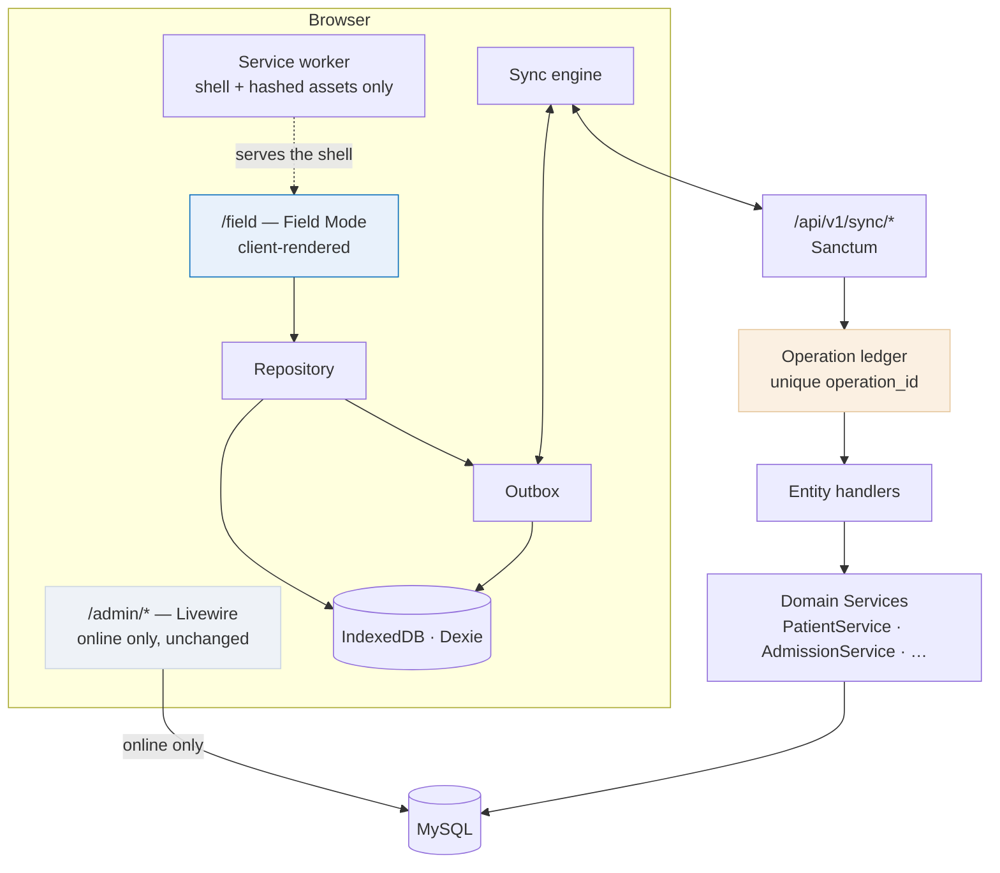

# Offline architecture

What was built, where each piece lives, and why it is shaped the way it is.

The [implementation plan](OFFLINE_FIRST_IMPLEMENTATION_PLAN.md) is the design
argument; this is the map of the result. For the wire contract see
[the protocol](OFFLINE_SYNC_PROTOCOL.md); for the threat model see
[security](OFFLINE_SECURITY.md).

---

## 1. The shape



**The admin panel is untouched.** It is 105 Livewire components whose state,
validation and rendering all live on the server; no service worker can make
them work offline. Field Mode is built *beside* them, not instead of them.

---

## 2. The client

`resources/js/offline/`

| File | Does |
|---|---|
| `db.js` | The Dexie schema. 25 stores, one database per `(hospital, user)`. Versions are append-only |
| `ids.js` | UUID v4 for records, ULID for operations. ULIDs sort by mint time, which is the outbox's send order |
| `clock.js` | Two clocks kept and both recorded. Blocks clinical capture past an hour of skew |
| `repository.js` | **The only way the UI writes.** Record + operation in one transaction (I-5) |
| `outbox.js` | The durable queue. Seven states, dependency ordering, jittered backoff, cascade refusal |
| `transport.js` | The one place that talks to the server. Distinguishes "no answer" from "an answer we did not like" |
| `sync-engine.js` | Push, then pull, then tell the tabs. Holds I-2 and I-4 |
| `lock.js` | Web Locks, with a `localStorage` lease fallback. Plus `TabChannel` |
| `connectivity.js` | Seven states. Learns from real request outcomes, not `navigator.onLine` |
| `conflicts.js` | Deciding a conflict — keep mine, keep theirs, or close one somebody else settled |
| `workflows.js` | The capture workflows: what a clinician actually does at the bedside |
| `base.js` | Where the app is served from. Nothing assumes the origin root |
| `worker.js` | Registers the service worker; an update waits until the user agrees |
| `index.js` | `OfflineClient` — one object the UI talks to |

`resources/js/field.js` is the Vite entry. It bundles Alpine, which
`admin.js` deliberately does not: the admin layout gets Alpine from Livewire,
and a second copy would double-boot every `x-data` there.

### The two orderings that matter

```js
// Repository — a record and its operation, or neither (I-5)
await db.transaction('rw', db[store], db.outbox, db.audit, async () => {
    await db[store].add(row);
    await db.outbox.add(operation);
});

// Sync engine — commit the page, THEN move the cursor (I-4)
await this.applyChanges(changes);
await this.saveCursor(cursor);
```

Reverse either and the failure is silent: work that looks saved and is not, or
a page of server changes lost permanently because the cursor moved past it.

---

## 3. The server

`app/Services/Sync/`

| Class | Does |
|---|---|
| `OperationLedger` | **The idempotency gate.** One transaction per operation, and a claim that outlives a rolled-back attempt |
| `SyncEngine` | Applies a batch. One transaction per operation, authorisation per operation |
| `EntityHandler` | The contract: `authorize()` and `apply()`, returning one of four answers |
| `Handlers/PatientHandler` | Registration with a server-allocated number; three-way field merge |
| `Handlers/AppendOnlyClinicalHandler` | Vitals, nursing notes, MAR — one handler, three entities |
| `PullService` | Permission-scoped, window-scoped, revision-ordered change streams |
| `PullCursor` | Encrypted, bound to `(hospital, device)` |

`app/Support/SyncRevision` hands out the per-hospital counter under a row lock —
the same shape `Support\Sequence` already uses for invoice numbers.

`app/Observers/SyncRevisionObserver` stamps it on **every** write, including
ones made through the admin panel. Without it, an edit made online would carry
no revision and no device would ever pull it.

### The one rule that matters most

> **Sync never writes rows directly.**

Every handler goes through the domain Service that already owns the rule —
`PatientService::register` for the checksummed number and the plan limit,
`AdmissionService` for the bed locks. The moment sync writes a row itself,
every invariant those Services hold is bypassed for offline users only, which
is precisely the population least able to notice.

---

## 4. Schema

Five migrations, all additive, all run on live MySQL with counts verified
before and after.

| Table / column | For |
|---|---|
| `devices` | Which machines hold a copy; revocation with a reason |
| `sync_operations` | The idempotency ledger. **`operation_id` is UNIQUE** — that index is the guarantee |
| `sync_sessions` | One row per push or pull round |
| `sync_conflicts` | Field names in dispute, never values |
| `sync_revisions` | The per-hospital counter |
| `sync_revision` on 13 tables | The pull cursor's ordering |
| `version` on 3 tables | Optimistic concurrency, only where a record is both offline-editable and mutable |
| `uuid` on the 3 bedside tables | The id the device minted, kept for life |
| `origin_device_id`, `origin_operation_id`, `client_created_at` | Provenance |

A backfill migration gives every pre-existing row a revision. Without it a
hospital would enable offline mode and find its patient list empty.

`down()` drops the index before the column, because SQLite refuses otherwise
and `OrderMigrationTest` rolls these back and forward on exactly that driver.

---

## 5. Conflicts

| Entity | Strategy |
|---|---|
| Patient demographics | Three-way field merge |
| `dob`, `sex`, `blood_type`, `allergies`, `chronic_conditions` | **Never auto-merged.** A wrong date of birth changes drug dosing |
| Vitals, nursing notes, MAR | No conflict possible — append-only by construction |
| Identity (`patient_no`, `uuid`, `hospital_id`) | Server authoritative, immutable |

### Deciding one

Detecting a conflict is half a feature. Without a way to decide, the operation
sits as `conflict` for ever, the "needs you" count never clears, and somebody
is told they have unfinished work they cannot finish.

Two answers, and only two — a third would be a merge, and a merge is what the
server already tried before it gave up and asked:

- **Keep theirs.** The local record takes the server's values, so the device
  stops showing something the server has rejected and the next edit does not
  produce the same conflict again. The operation is cancelled with a reason.
- **Keep mine.** A **new** operation carrying only the contested fields, with
  the server's current version as `base_version` and the server's current
  values as `base_fields`. Because base now matches what the server holds, its
  own three-way merge applies it cleanly. Re-sending the original would be
  contested again for exactly the same reason.

Both are audited with the field NAMES and never their values. A conflict the
server settles some other way — a pull brings a version past the disputed one
— closes itself, so nobody adjudicates a question nobody is asking.

The three-way merge needs three sides, and the third is the one usually
forgotten: **what the server last told this device the field held**. The device
sends it as `base_fields`. With it, "did the server change this too?" is a fact:

```
server === base  →  only the device moved it  →  merge
server !== base  →  both moved it             →  contested
```

Inferring from version numbers instead cannot explain an edit made through the
online panel, so it must assume the worst — and one receptionist changing an
address would block every offline edit of that patient.

---

## 6. The service worker

`public/field-sw.js`, scoped to `/field`.

`public/sw.js` in this repo is a kill-switch, and its comment says why: *"An
earlier build registered a cache-first worker that served stale assets after
deploys."* Every rule in the new worker exists because that already happened.

1. Only content-hashed `/build/assets/…-[hash].js` is cache-first — those bytes
   cannot change.
2. The shell is network-first. A cached copy is served only when the network
   genuinely failed.
3. `skipWaiting()` appears exactly once, in the message handler. The user is
   asked.
4. **The worker contains no database code at all.** Invariant I-6 is true by
   construction, not by care.
5. No API response is ever cached.
6. A **failed** navigation to `/admin` is answered with a generated page
   explaining that the panel needs a connection and offering Field Mode. That
   is not caching admin HTML — nothing is stored — it is answering a
   navigation the network has already refused.
7. `UNREGISTER = true` retires it in one deploy.

**Paths are derived, never assumed.** The worker reads its own base from
`self.location.pathname`; the client reads a `td-base` meta tag the server
renders from `config('app.url')`. This installation is served from
`/true-doctor/`, and the first version hardcoded `/field` and `/api/v1` — so
it matched nothing and offline mode silently did not work.

---

## 7. Withdrawing it

Four independent levers, none of which deletes unsent work:

1. `config('offline.enabled') = false` — hides the entry point; devices keep
   their data and can still sync it.
2. `UNREGISTER = true` — the worker retires itself.
3. Revoke devices individually, with reasons.
4. Remove the sync routes — additive, so nothing else changes.

---

## 8. What is not built

| | Status |
|---|---|
| The ten Field Mode capture forms | Shell, client, sync and status bar built; the individual forms are not |
| Offline PIN / Web Crypto wrapping | Device registration and revocation are built; the PIN store is not |
| Attachments | Not built |
| Lab results, dispensing intents, appointment check-in | Handlers not written; the pattern is `AppendOnlyClinicalHandler` |

Tracked in [`OFFLINE_IMPLEMENTATION_PROGRESS.md`](OFFLINE_IMPLEMENTATION_PROGRESS.md).
Nothing in this list is marked passed anywhere.
