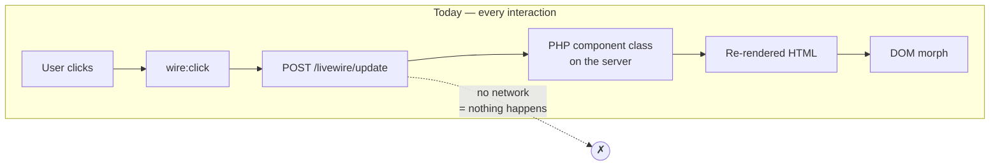
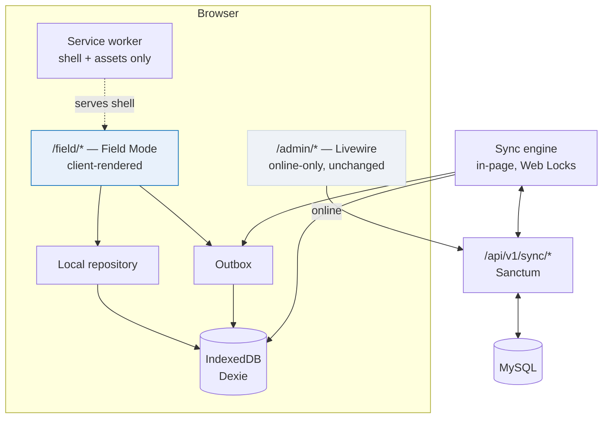
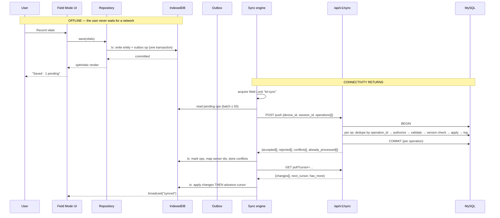
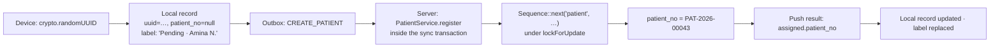
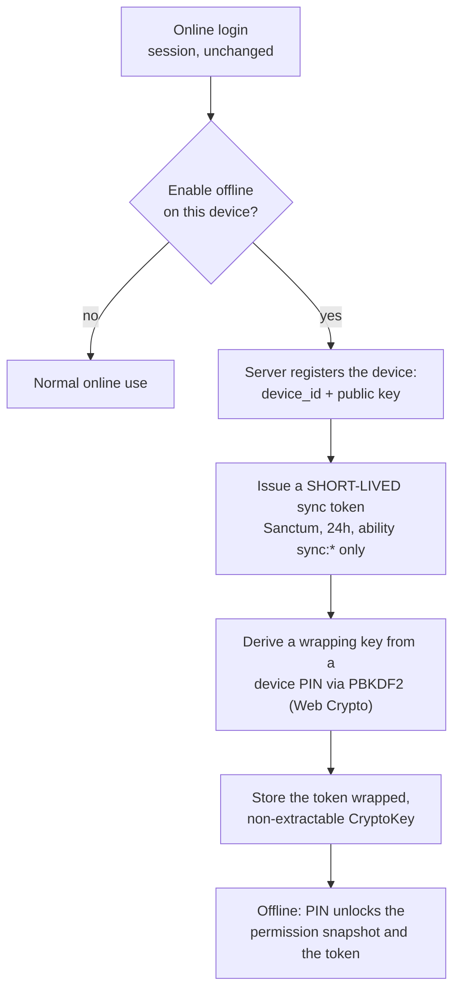

# Offline-first — master implementation plan

**Status:** Draft for sign-off. No production code has been written against it.
**Date:** 2026-09-19
**Supersedes:** the 2026-07-18 entry in [`decisions.md`](decisions.md) that put offline sync out of
scope for v1. That entry said the feature would only be built once *"conflict resolution, on-device
PHI encryption, and queue-and-replay semantics get designed up front, not scaffolded
speculatively."* This document is that design.

---

## 0. The recommendation in one paragraph

True-Doctor's back office is **105 Livewire components**. A Livewire component is a PHP class that
lives on the server; every click is an HTTP POST to `/livewire/update` that returns re-rendered HTML.
**There is no version of "add a service worker" that makes a Livewire screen work offline** — the
code that would have to run is not on the device. So the choice is not *how* to make the existing
app offline-capable; it is *what to build beside it*. The recommendation is a bounded,
client-rendered **Field Mode**: a small self-contained surface at `/field`, served from an
IndexedDB-backed local store with a durable outbox, covering the ten or so workflows that a hospital
genuinely cannot stop doing when the line drops — patient registration, vitals, nursing notes,
medication administration, clinical notes, lab specimen collection and results, dispensing intents,
and appointment check-in. Everything else stays online-only Livewire and says so. This is the same
shape OpenMRS, Bahmni, DHIS2 and CommCare all landed on, and for the same reason: an offline
*capture* app is achievable and safe; an offline *everything* app is a rewrite.

The single largest piece of good news from the survey: **the records that matter most for offline
work are already append-only** (`VitalRound`, `NursingNote`, `MedicationAdministration`,
`StockMovement`, `Payment`, `CardRecord` all set `UPDATED_AT = null`). Append-only records cannot
conflict. That is not a coincidence we can rely on for free, but it means the hard part of this
project — conflict resolution — shrinks to a short list of genuinely mutable entities.

---

## 1. What the system actually is

Findings from the survey, with the consequences each one has for this project.

### 1.1 Stack

| Thing | What it is | Consequence |
|---|---|---|
| Backend | Laravel 12, PHP 8.3 | — |
| Back office | **Livewire 3**, 105 components, server-rendered, `wire:navigate` | **Cannot run offline.** §2 |
| Auth (web) | Session, `database` driver, 120-minute lifetime | Session cookie is useless offline; §12 |
| Auth (API) | **Laravel Sanctum**, personal access tokens | The substrate for sync auth; §12 |
| API | `/api/v1/*`, 46 routes, one `ApiResponse` envelope, same Policies as the panel | Sync API should extend this, not fork it |
| JS dependencies | **None.** `package.json` has only Vite + PostCSS | Greenfield; every byte added is a decision |
| Alpine | Ships inside Livewire, deliberately *not* bundled | A Field Mode client must not double-boot it |
| CSS | Hand-written `tb-*` system, `resources/css/admin.css` | Field Mode reuses it; no second design system |
| Queue | `database` driver + Horizon | Server-side sync work can be queued |
| Realtime | **None.** No `config/broadcasting.php`, no Echo, no Reverb | No push channel; sync is client-initiated |
| Tests | PHPUnit 11, SQLite `:memory:`, **1609 passing** | No JS test runner exists yet; §19 |
| Tenancy | `BelongsToHospital` + `HospitalScope` + `CurrentHospital`, resolved by `ResolveHospital` middleware ordered **before** `SubstituteBindings` | Sync endpoints must resolve tenancy the same way or leak across hospitals |
| RBAC | `spatie/laravel-permission`, Policies shared by panel and API | Offline permission cache is a *hint*; server re-checks |
| Money | bcmath strings throughout, `FinancialYear` closed-period guards | §10.3 |
| Audit | `spatie/laravel-activitylog` on `Patient` and `Visit` only | Extend for offline provenance; §17 |

### 1.2 The service worker scar

`public/sw.js` is currently a **kill-switch**:

> *"An earlier build registered a cache-first worker that served stale assets after deploys. This
> worker only cleans up: it deletes every cache, unregisters itself and reloads open tabs."*

This is the most important cultural fact in the survey. A naive cache-first worker already shipped
here once and already broke production. Any new worker must be **network-first for documents**,
cache-only for Vite's content-hashed assets, and must carry a kill-switch of its own from day one
(§14). The plan treats "the service worker can be turned off in one deploy without losing user data"
as a hard requirement, not a nicety.

### 1.3 Identity, and the numbering problem

Twenty models already carry a `uuid`: `Patient`, `Visit`, `Admission`, `Appointment`, `Invoice`,
`Order`, `Payment`, `CardRecord`, `LabOrder`, `RadiologyOrder`, `Prescription`, `Dispensation`,
`StockItem`, `TreatmentRecord`, and more. **Offline ID generation is therefore already supported by
the schema** for exactly the entities that matter. That removes what is normally the first big
migration in a project like this.

What is *not* solved is human-facing numbering. `patient_no`, `visit_no` and `invoice_no` come from
`App\Support\Sequence`, which increments one row per `(hospital, key, period)` **under
`lockForUpdate()`**, backed by a composite unique index. That is correct and must not change. It is
also impossible offline: two devices cannot both allocate `PAT-2026-00043`.

**Decision:** an offline-created record gets its UUID on the device and its human number **from the
server, at sync time**. Until then the UI shows a provisional label that is visibly provisional
(`Pending · Amina N.`), never a fake number that looks real. The `patient_no` column stays
`NOT NULL` server-side; it is simply assigned inside the sync transaction, by the same `Sequence`
call registration already uses.

### 1.4 What is already append-only

| Model | `UPDATED_AT = null` | Meaning for sync |
|---|---|---|
| `VitalRound` | yes | Insert-only. No conflict possible. |
| `NursingNote` | yes | Insert-only. |
| `MedicationAdministration` | yes | Insert-only. |
| `StockMovement` | yes | Insert-only — but `balance_after` is computed under a lock on the item. §10.2 |
| `Payment` | yes | Insert-only — but `balance_after` likewise. §10.3 |
| `CardRecord` | yes | Insert-only, same caveat. |
| `VisitStatusHistory`, `AppointmentStatusHistory`, `BedTransfer` | yes | Insert-only. |

This is why the offline scope in §4 is drawn where it is: **the workflows that are already
append-only are the workflows that are safe to take offline.** Everything mutable is treated with
suspicion.

### 1.5 What has no version column

`grep` across all 87 migrations finds **no `version` / `revision` / `lock_version` column anywhere**.
Optimistic concurrency does not exist in this system today. It must be added, but only to the short
list of entities in §10.1 that are (a) offline-editable and (b) genuinely mutable. Adding a version
column to all 58 models would be exactly the speculative scaffolding `decisions.md` warns against.

---

## 2. The defining constraint



A Livewire component's state, validation, authorisation and rendering are all server-side. Offline,
the POST fails and the screen is inert. The existing banner in `layouts/admin.blade.php` is honest
about this — *"You're offline — changes can't be saved until the connection returns."*

Three ways out:

| Option | What it means | Cost | Verdict |
|---|---|---|---|
| **A — Rewrite as an SPA** | Replace 105 Livewire components with a JS client against `/api/v1` | Enormous. Throws away the work `docs/frontend-spa-proposal.md` deliberately chose *against*, and most of 1609 tests exercise Livewire components | **No** |
| **B — Bounded offline client** | A separate client-rendered surface for a chosen set of workflows; rest stays Livewire | Weeks, contained, additive, deletable | **Recommended** |
| **C — Livewire "queue and replay"** | Intercept `/livewire/update` in a service worker, queue the POSTs, replay later | **Actively dangerous.** A Livewire request carries an encrypted server-side snapshot and a checksum; replaying a stale snapshot hours later against changed data produces silent, unauditable writes with no conflict detection. It also cannot render anything while offline | **No** |

Option C deserves a sentence of warning because it is the one that looks cheapest and is the one that
loses patient data. Livewire payloads are not idempotent, not self-describing, and not safe to
replay. If anyone proposes it later, this paragraph is the answer.

### 2.1 Recommended shape



When the server is unreachable, `/admin/*` offers a **"Continue in Field Mode"** door rather than a
dead banner. When it returns, Field Mode syncs and the user can go back. The two surfaces share the
`tb-*` CSS, the domain Services on the server, and nothing else.

---

## 3. Classification method

Every operation is graded against four questions:

1. **Is the record append-only?** If yes, no conflict is possible and offline is cheap.
2. **Does it need a server-allocated identifier** (`Sequence`, gateway reference, invoice number)?
3. **Does it read state the device cannot know is current** — a stock balance, a card balance, a bed's
   occupancy, an invoice's outstanding amount? Writing against a stale read of these is how money and
   medicine go wrong.
4. **Is the blast radius of getting it wrong clinical, financial, or merely annoying?**

A workflow is only **offline-capable** if it is append-only *or* versioned, needs no server-allocated
number *at capture time*, and either reads nothing volatile or can express its write as an **intent**
the server resolves authoritatively.

---

## 4. Module inventory and classification

Categories: **(1)** fully offline-capable · **(2)** offline with sync · **(3)** read-only offline ·
**(4)** online-only · **(5)** unsafe offline without additional controls.

### 4.1 Patients — `App\Livewire\Patients`, `PatientService`

| Operation | Class | Reasoning |
|---|---|---|
| Search / view recent patients | **3** | Cached slice only (§15). A device must never hold the whole register. |
| Register a patient | **2** | Append-only in effect; UUID on device, `patient_no` from `Sequence` at sync. Duplicate-person risk is real but is a *data quality* problem with a merge workflow, not a corruption problem. |
| Edit demographics | **2** | Mutable → needs `version` + field-level merge (§10.1). |
| Archive (soft delete) | **4** | Rare, destructive, no clinical urgency. Nothing is gained by allowing it offline. |
| Dependents / guardians | **4** | `linkDependent` reads another patient by UUID and enforces uniqueness server-side. |
| Documents / photos | **2** | Blob queue (§16). |

### 4.2 Visits & orders — `VisitService`, `OrderService`

| Operation | Class | Reasoning |
|---|---|---|
| Open a visit | **2** | `visit_no` from `Sequence` at sync, UUID on device. |
| Record vitals | **1** | `VitalRound` is append-only; BMI is computed by `VisitService`, never accepted from the client — that stays true, the server computes it at sync. |
| Clinical notes / diagnosis | **2** | Mutable fields on `Visit`. Treat as **append-only clinical entries** offline (§10.4) rather than overwriting `Visit.diagnosis`. |
| Place an order | **2** | `Order` carries a UUID. Price is copied from the catalogue — the device has a cached catalogue version, and the server re-prices at sync (§10.3). |
| Advance visit stage | **5** | The gate reads "no order still open", which a device cannot know. Offline may *request* a transition; the server decides. |
| Cancel a visit | **4** | Has billing consequences. |

### 4.3 Inpatient — `AdmissionService`

| Operation | Class | Reasoning |
|---|---|---|
| Occupancy board (read) | **3** | Snapshot with a visible "as of" time. A stale bed map is the point of failure here. |
| Vitals round | **1** | Append-only. |
| Nursing note | **1** | Append-only. |
| Medication administration (MAR) | **1** | Append-only. The highest-value offline workflow in the hospital. |
| Admit a patient | **5** | Bed exclusivity is enforced by `lockForUpdate` on the bed — two devices can both "admit" to bed 4. Allowed offline **only** as an intent, with server-side rejection and a clear conflict surface. |
| Transfer | **5** | Same reason. |
| Discharge | **4** | Bills the stay through `BillingService`. Financial. |

### 4.4 Laboratory & radiology — `LabService`, `RadiologyService`

| Operation | Class | Reasoning |
|---|---|---|
| Worklist (read) | **3** | Scoped to today + open orders. |
| Mark specimen collected | **1** | Status append via history. |
| Enter a result | **2** | `LabOrderItem.result_value` is mutable → version-controlled, never silently overwritten (§10.1). A result overwritten by a stale device is a patient-safety event. |
| Attach analyser output | **2** | Blob queue. |
| Cancel an order | **4** | Billing consequence. |

### 4.5 Pharmacy — `DispensationService`, `StockService`

| Operation | Class | Reasoning |
|---|---|---|
| Formulary (read) | **3** | Reference data. |
| Stock levels (read) | **3** | Explicitly labelled "as of" — never presented as live. |
| Dispense | **5** | `StockService::post()` computes `balance_after` under a lock on the item row. A device cannot compute it. Offline records a **dispensing intent**; the server posts the movement and may reject for insufficient stock. Nothing that reduces a balance is ever computed on the device. |
| Receive / adjust / write off stock | **4** | Costing and ledger integrity; no field urgency. |

### 4.6 Billing, payments, cards, insurance

| Operation | Class | Reasoning |
|---|---|---|
| View an invoice | **3** | With an "as of" stamp. |
| Generate an invoice | **4** | `Sequence` + `FinancialYear` closed-period guard + tax. Server only. |
| Take a payment | **5** | `Payment.balance_after` is computed under lock; gateway references are server-issued. **Default: online-only.** If the hospital insists on offline cash receipts, the only safe form is an append-only *receipt intent* with a device-printed provisional slip and no balance shown (§10.3). Recommend deferring to a later phase. |
| Card top-up / charge | **4** | `CardService` locks the card row. Overdraft rules cannot be evaluated on stale data. |
| Insurance claims | **4** | Lifecycle and float are server-authoritative. |

### 4.7 Scheduling

| Operation | Class | Reasoning |
|---|---|---|
| Today's diary (read) | **3** | Cached day window. |
| Check in an arrival | **1** | A status append. The classic reception-desk offline need. |
| Book an appointment | **5** | Double-booking is prevented by `lockForUpdate` on `doctor_schedules`. Offline booking is an intent the server may reject. |
| Cancel / reschedule | **4** | Frees a slot others may take. |

### 4.8 Everything else

**Online-only (4)** without further discussion: settings, hospital profile, billing settings,
letterhead, users and roles, staff profiles, departments, wards, beds, rooms, catalogues (services,
lab tests, radiology studies, stock categories), financial years, insurance providers, subscription
and plan limits, reports, dashboards, notifications, onboarding, super-admin. None of them is
time-critical, all of them are administrative, and each would add schema and conflict surface for no
clinical benefit.

### 4.9 Summary — the offline scope

**Phase-1 Field Mode ships exactly this:**

1. Patient lookup (cached slice) and registration
2. Patient demographic edit
3. Open a visit
4. Record vitals
5. Clinical note (append-only entry)
6. Nursing note
7. Medication administration
8. Lab specimen collection + result entry + attachment
9. Appointment check-in
10. Dispensing intent

Ten workflows. Every one is either append-only or versioned; none allocates a human-facing number on
the device; none computes a balance.

---

## 5. Technology choices

Nothing is added that is not load-bearing. Current JS dependency count is **zero**, and the bar for
raising it is correspondingly high.

| Package | Size | Why it is needed | Why not hand-roll |
|---|---|---|---|
| **`dexie`** (~25 KB min+gz) | small | IndexedDB wrapper: schema versioning, upgrade hooks, transactions across stores, typed queries, `liveQuery` for multi-tab reactivity | Raw IndexedDB is famously error-prone around transaction lifetimes and versioned upgrades. §7 needs 18 stores and real migrations. This is the one place where hand-rolling costs more than it saves. |
| **`vitest`** + **`fake-indexeddb`** (dev only) | dev | There is currently **no JS test runner at all**. The outbox, sync engine, and migrations are the riskiest code in this project and are untestable in PHPUnit | Testing IndexedDB logic through a browser harness only is slow and flaky in CI |

**Deliberately not adding:**

- **Workbox** — the worker we need is ~80 lines of network-first + one immutable cache. Workbox's
  value is in complex runtime caching strategies we are explicitly *not* using for application data,
  and it would reintroduce the generated-worker opacity that produced the 2026 stale-asset incident.
- **A JS framework (Vue/React/Svelte)** — Field Mode is ten forms and three lists. Alpine already
  ships inside Livewire and is available on the page; Field Mode uses it. Adding a second runtime
  contradicts `docs/frontend-spa-proposal.md` and doubles the bundle.
- **A CRDT library (Yjs, Automerge)** — the conflict surface after §4 is roughly five mutable
  entities. Version numbers and field-level merge handle it. CRDTs are the right answer to
  collaborative text editing, not to a nurse and a doctor both editing a phone number.
- **`idb`** — a thinner alternative to Dexie, but without schema-version migrations, which §18
  requires.

**Browser APIs used directly, no wrapper:** Service Worker, Cache Storage, Web Locks, BroadcastChannel,
Web Crypto, Background Sync (progressively, never relied on — §13).

---

## 6. Data flow



The two transactional boundaries that matter, and why:

- **Entity write and outbox enqueue are one IndexedDB transaction.** If they were two, a crash
  between them either loses the operation (work vanishes) or leaves an operation for an entity that
  was never written.
- **Pulled changes are persisted before the cursor advances.** The reverse order loses every change
  in the batch on a crash, permanently, because the server will never send them again.

---

## 7. Local database design

**Dexie, database name `td-offline`, one database per `(hospital_id, user_id)` pair.** Separate
databases rather than a discriminator column, so logging out or switching hospitals is a `delete()`
rather than a careful sweep — and so a shared workstation cannot leak one clinician's cache into
another's session (§17).

### 7.1 Stores

Only what the ten workflows in §4.9 need. Not a mirror of 58 server tables.

**Working data**

| Store | Keys / indexes | Notes |
|---|---|---|
| `patients` | `uuid`, idx `patient_no`, `search_key`, `updated_at`, `_sync` | Cached slice + locally created |
| `visits` | `uuid`, idx `patient_uuid`, `status`, `_sync` | |
| `encounters_notes` | `uuid`, idx `visit_uuid`, `created_at` | Append-only clinical entries |
| `vitals` | `uuid`, idx `visit_uuid`, `admission_uuid`, `created_at` | Append-only |
| `nursing_notes` | `uuid`, idx `admission_uuid`, `created_at` | Append-only |
| `med_administrations` | `uuid`, idx `admission_uuid`, `created_at` | Append-only |
| `orders` | `uuid`, idx `visit_uuid`, `type`, `status` | |
| `lab_items` | `uuid`, idx `lab_order_uuid`, `_sync` | Carries `version` |
| `appointments` | `uuid`, idx `scheduled_on`, `doctor_id`, `status` | Day window |
| `admissions` | `uuid`, idx `bed_id`, `patient_uuid` | Read-mostly |
| `dispense_intents` | `uuid`, idx `visit_uuid`, `_sync` | Never carries a balance |
| `attachments` | `uuid`, idx `owner_uuid`, `_sync` | Metadata + `Blob` |

**Reference data** — `ref_services`, `ref_lab_tests`, `ref_medications`, `ref_diagnoses`,
`ref_staff`, `ref_departments_wards_beds`, `ref_districts`. Each row carries `ref_version`.

**Machinery**

| Store | Purpose |
|---|---|
| `outbox` | The durable operation queue (§8) |
| `sync_state` | Singleton row: cursors, last success, protocol version, schema version |
| `conflicts` | Server-reported conflicts awaiting a human |
| `audit` | Local provenance for every operation (§17) |
| `session` | Device id, user id, hospital id, permission snapshot, expiry (§12) |

### 7.2 The envelope every entity row carries

```ts
{
  uuid:            string,      // client-generated, crypto.randomUUID()
  server_id:       number|null, // filled at sync; never used as a local key
  version:         number,      // last version acknowledged by the server; 0 = never synced
  created_at:      string,      // ISO 8601 with offset, device clock
  updated_at:      string,
  deleted_at:      string|null, // tombstone; rows are never removed locally
  _sync:           'local'|'pending'|'synced'|'conflict'|'rejected',
  _device_id:      string,
  _origin:         'local'|'server',
  _server_version: number|null, // what the server last told us it held
}
```

`uuid` is the only key the client ever uses. `server_id` exists so pulled data can be reconciled, and
is never a local foreign key — foreign keys between local stores are always UUID-to-UUID, so a record
created offline can reference another record created offline in the same breath.

### 7.3 Clock skew

Device clocks are wrong. `created_at` is recorded from the device *and* from `performance.timeOrigin`
so a device whose clock jumps mid-session can be detected. The server stores the client timestamp as
`client_created_at` (provenance) and stamps its own `created_at` (authority). Ordering decisions
never use a client clock. At login the server returns its time and the client records the offset;
a skew beyond ±5 minutes shows a warning and beyond ±1 hour blocks offline capture, because a
mis-stamped vitals round is a clinical record nobody can interpret.

---

## 8. The outbox

```jsonc
{
  "operation_id": "01J…",        // ULID — sortable, so replay order is the enqueue order
  "entity":       "vitals",
  "entity_uuid":  "…",
  "operation":    "create",       // create | update | delete | intent
  "payload":      { },            // complete, self-describing; never a diff against server state
  "base_version": null,           // the version the device believed it was editing
  "created_at":   "…",
  "device_id":    "…",
  "user_id":      42,
  "status":       "pending",      // §8.1
  "retry_count":  0,
  "next_retry_at": null,
  "last_error":   null,
  "depends_on":   ["01J…"]        // §8.2
}
```

`payload` is **complete, not a delta**. A delta computed against a stale base is unapplicable hours
later; a complete payload plus `base_version` lets the server decide.

### 8.1 States

```
pending → processing → synced
   │            │
   │            ├→ conflict   (needs a decision; never auto-discarded)
   │            ├→ rejected   (server said no, with a reason; recoverable by the user)
   │            └→ retrying   (transient; backoff)
   └→ cancelled (explicit user action only, and audited)
```

**No operation ever leaves the outbox except through `synced` or an explicit, audited `cancelled`.**
This is invariant I-3 (§18).

### 8.2 Ordering and dependencies

A visit created offline and a vitals round on it must arrive in that order. `depends_on` carries the
`operation_id`s that must be accepted first. The engine ships a batch in ULID order and holds back
any operation whose dependencies are not yet `synced`. If a dependency is `rejected`, its dependants
become `rejected` too with `reason: "depends on a rejected operation"` — never silently dropped, and
never sent to orphan themselves against a parent that does not exist.

### 8.3 Backoff

`5s · 15s · 30s · 60s · 5m · 15m`, then hourly, capped at 24 attempts, with ±20% jitter so a ward of
devices reconnecting together does not arrive as a thundering herd. After the cap the operation is
`failed` and surfaces in the sync dashboard for a human — still in the outbox, still recoverable.

---

## 9. The sync API

New routes, inside the existing `auth:sanctum` group in `routes/api.php`, using the existing
`ApiResponse` envelope and the existing Policies.

```http
POST /api/v1/sync/push      batch of operations   → per-operation results
GET  /api/v1/sync/pull      ?cursor=&limit=       → changes + next_cursor + has_more
POST /api/v1/sync/ack       confirm persistence   → advances server-side checkpoint
GET  /api/v1/sync/status    device view           → pending server-side, protocol version
POST /api/v1/sync/bootstrap initial dataset       → paginated first download
GET  /api/v1/sync/reference ?since=version        → changed reference data only
```

Dedicated endpoints rather than the existing CRUD, for four reasons: batching, per-operation results
that do not fail the batch, idempotency keyed on `operation_id`, and version checks. Forcing
`PatientController@store` to do all four would make the ordinary API worse.

### 9.1 Push response

```jsonc
{
  "success": true, "code": "ok",
  "data": {
    "sync_session_id": "…",
    "results": [
      { "operation_id": "01J…", "status": "accepted",
        "entity": "patient", "entity_uuid": "…",
        "server_id": 913, "version": 1,
        "assigned": { "patient_no": "PAT-2026-00043" } },

      { "operation_id": "01J…", "status": "already_processed",
        "server_id": 913, "version": 1 },

      { "operation_id": "01J…", "status": "conflict",
        "base_version": 3, "server_version": 5,
        "conflict": { "strategy": "field_merge",
                      "merged": {"phone_1": "…"},
                      "contested": ["dob"],
                      "server_state": { } } },

      { "operation_id": "01J…", "status": "rejected",
        "reason_code": "insufficient_stock",
        "message": "Only 4 left on the shelf.",
        "errors": {"quantity": ["…"]} }
    ],
    "server_time": "…"
  }
}
```

Four statuses, each with a defined client action:

| Status | Client does |
|---|---|
| `accepted` | Apply `server_id`, `version`, `assigned` fields; mark `synced` |
| `already_processed` | Identical handling. This is the idempotent replay path (§9.3) |
| `conflict` | Store in `conflicts`; apply auto-merge where the strategy says so; otherwise raise for a human |
| `rejected` | Mark `rejected`, keep the payload, show the reason, offer edit-and-retry |

### 9.2 Server-side processing

One transaction **per operation**, not per batch — so one bad operation does not roll back forty
good ones. §9.5 covers the exception.

```
FOR EACH operation:
  BEGIN
    SELECT … FROM sync_operations WHERE operation_id = ? FOR UPDATE   -- idempotency gate
    IF found → COMMIT, return the stored result verbatim
    INSERT sync_operations (operation_id, status='processing')        -- unique index = the real lock
    resolve tenant (hospital_id from the token's user, never from the payload)
    authorize via the existing Policy
    validate via the existing FormRequest rules
    IF entity is versioned AND base_version != current → record conflict, COMMIT, return
    apply through the existing domain Service (PatientService, VisitService, …)
    allocate Sequence numbers if the entity needs one
    UPDATE sync_operations SET status, result, server_id, version
    write activity log with device/user/operation provenance
  COMMIT
ON EXCEPTION → ROLLBACK, mark 'failed', return a reason; the operation stays retryable
```

**The mutation goes through the existing Services.** Not a parallel write path. This is the single
most important implementation rule in the document: the moment sync writes rows directly, every
invariant those Services hold — bed locking, sequence allocation, ledger balances, closed-period
guards — is bypassed for offline users only, which is precisely the population least able to notice.

### 9.3 Idempotency

`sync_operations.operation_id` carries a **unique index**. That index, not application logic, is what
makes replay safe — two concurrent requests carrying the same operation race, one inserts, the other
gets a constraint violation and returns the stored result.

The scenario that must be tested explicitly (§19):

```
client → CREATE_PATIENT (op 01J…)
server → patient created, result stored
network drops before the response arrives
client → CREATE_PATIENT (op 01J…)   [same id]
server → already_processed, same server_id, no second patient
```

Results are retained for **90 days**, then pruned; the client's backoff caps well inside that, and an
operation older than 90 days arriving is treated as `rejected: expired` rather than replayed blind.

### 9.4 Pull

Cursor is an opaque, signed string encoding `(hospital_id, user_id, server_revision, tie-break id)`.
Signed because an attacker-supplied cursor must not be able to widen the scope of what is returned.

Server revision comes from a monotonic `sync_revision` bigint on each syncable table, assigned from a
per-hospital counter. Using `updated_at` instead is a known trap: timestamps collide at second
resolution and rows updated inside one transaction can carry timestamps that straddle another
reader's cursor, silently skipping changes.

Page size 200, `has_more` until drained. **The client persists changes and only then advances the
cursor** (§18, I-4).

### 9.5 Batching rule

Independent operations are independent. The only operations that share a transaction are those
explicitly marked as a unit (e.g. a visit and its first order, where a half-applied pair would leave
an orphan) — declared by the client as `atomic_group_id`, honoured by the server.

---

## 10. Conflict resolution

Per entity. "Last write wins" is used only where it is genuinely harmless, and never for anything
clinical or financial.

### 10.1 Strategy table

| Entity | Strategy | Reasoning |
|---|---|---|
| `Patient` demographics | **Field-level merge**, server wins contested fields | Two desks editing different fields (one the phone, one the address) must both survive. A genuinely contested field (both changed `dob`) is raised to a human — a wrong date of birth changes drug dosing. |
| `Patient` identity (`patient_no`, `uuid`, `hospital_id`) | **Server authoritative**, immutable | `PatientService::update` already strips these. |
| `VitalRound`, `NursingNote`, `MedicationAdministration` | **Append-only — no conflict possible** | Two devices recording two rounds recorded two rounds. Both are true. |
| Clinical notes | **Append-only, versioned entries** | A note is never overwritten. Editing appends a revision that supersedes, with both retained. This is the §4.2 decision not to overwrite `Visit.diagnosis`. |
| `LabOrderItem` result | **Version-controlled, manual resolution** | A result overwritten by a stale device is a patient-safety event. If `base_version` is stale the write is *refused* and raised, never merged. |
| `Order` / `OrderItem` | **Server authoritative on price**, client on clinical content | The device caches a catalogue version; the server re-prices at sync from the live catalogue and reports the difference. |
| `Appointment` status | **Server authoritative** (state machine) | `AppointmentStatus::canTransitionTo` decides; an illegal move from a stale device is rejected with the current state returned. |
| `Admission` (admit/transfer) | **Server authoritative, first-wins** | Bed exclusivity is a `lockForUpdate`. The loser gets a conflict naming the bed and the patient now in it. |
| `StockMovement` / dispensing | **Server computes, may reject** | The device sends an intent; `StockService` posts under lock and computes `balance_after`. Insufficient stock is a rejection with the real figure. |
| `Payment`, `CardRecord`, `Invoice` | **Online-only** (§4.6) | Not offline, so no strategy needed. If ever taken offline, append-only intent + server-issued receipt number, never a device-computed balance. |
| Reference data | **Server authoritative, replace** | The device never edits it. |

### 10.2 Delete versus update

Tombstones, never row removal. If device A deletes while device B edits:

- **Clinical and financial entities** — the edit wins and the delete is raised as a conflict. Deleting
  a record someone was actively working on is far more likely to be the mistake.
- **Reference and administrative entities** — the delete wins; the edit is rejected with "this was
  archived".

A tombstone is retained for 180 days before the row is compacted, so a device that has been offline
for a season still learns the record is gone rather than resurrecting it.

### 10.3 Money — the explicit decision

**No financial operation is offline-capable in phase 1.** `Payment.balance_after`,
`Invoice.balance`, and `PatientCard.balance` are all caches of an append-only ledger, computed under
row locks, guarded by `FinancialYear`. A device that cannot see the ledger cannot compute them, and
a receipt that names a balance the server disagrees with is worse than no receipt.

If offline cash receipting is later required, the only safe shape is: an append-only *receipt intent*
carrying amount, method, patient and a device-issued reference; a printed slip that says
**"Provisional — not yet posted"**; no balance anywhere on it; and server-side posting that may
reject. That is a separate project with its own sign-off.

### 10.4 Clinical safety

Every offline clinical record carries, immutably: `user_id`, `device_id`, `operation_id`,
`client_created_at`, `server_created_at`. A note is never destructively edited; a correction is a
new versioned entry that supersedes and cites the one it replaces. This mirrors what
`VisitStatusHistory` and `CardRecord` already do, and is why §4 pushed clinical notes toward
append-only.

---

## 11. Identity and numbering



Provisional labels are **visibly provisional**. A device must never render a plausible-looking number
that later changes — a clinician who has written `PAT-2026-00043` on a specimen bottle and finds the
system disagrees has been actively harmed by the interface.

---

## 12. Offline authentication

**Never store a password, a password hash, or a long-lived token in IndexedDB.**



- **Device registration** is an explicit, audited act. A `devices` table records device id, user,
  hospital, label, registration time, last seen, and revoked-at. An admin can revoke; a revoked
  device's next sync is refused and it wipes its local database.
- **The sync token is short-lived** (24 h) and carries only `sync:*` abilities — it can push and pull,
  not call the rest of the API. It is refreshed on every successful sync, so a device used daily never
  sees a prompt and a device that vanishes for a week must come back online to a real login.
- **Offline session** is bounded by a **12-hour working-day expiry**, independent of the token. Past
  it, capture stops; already-captured work is never destroyed and still syncs once the user
  re-authenticates. Losing a shift's notes because a session lapsed would be the worst possible
  failure mode, so expiry gates *new capture*, not *existing data*.
- **The PIN** is a shared-workstation control, not a cryptographic one against a determined attacker
  with the device. §17 states that limitation plainly rather than implying more.
- **Logout** wipes the local database — but **refuses if the outbox is non-empty**, offering "sync
  first" or an explicit, typed, audited "discard N unsynced changes".

---

## 13. Connectivity detection

`navigator.onLine` answers "is there a network interface", which is not the question. The real
question is "can I reach *this* server", and captive portals, VPN drops and a downed app server all
say `true`.

```
state = ONLINE | OFFLINE | CONNECTING | SYNCING | SYNCED | SYNC_ERROR | DEGRADED
```

Inputs, in order of authority:

1. **Real request outcomes** — the strongest signal. A failed sync means offline regardless of what
   the browser says.
2. **`GET /api/v1/sync/status`** — a cheap, authenticated reachability probe with a 5-second timeout.
3. **`online` / `offline` events** — a *hint* that triggers a probe, never a conclusion.
4. **`DEGRADED`** — reachable but slow or erroring (429/5xx). Sync backs off; capture continues.

Probe interval: 15 s while offline, 60 s while online, paused when the tab is hidden, and always
paused when `document.visibilityState === 'hidden'` so a backgrounded tab is not a battery drain.

The existing `tdOffline` Alpine component and the banner in `layouts/admin.blade.php` are replaced by
this, and the banner's text changes from "changes can't be saved" to a door into Field Mode.

---

## 14. Service worker

Scope is deliberately narrow, given §1.2.

| Cached | Strategy | Why |
|---|---|---|
| Vite hashed assets (`/build/assets/*-[hash].js|css`) | **Cache-first, immutable** | Content-hashed: a given URL's bytes never change |
| The Field Mode shell (`/field`) | **Network-first, cache fallback** | Never serve a stale shell when the network works |
| Fonts, icons | Cache-first with a version key | |
| `/admin/*` | **Never cached** | Livewire HTML is per-session and per-snapshot; caching it is the 2026 incident again |
| **Any API response with patient data** | **Never cached in Cache Storage** | PHI belongs in IndexedDB under the §12 controls, not in an HTTP cache no policy governs |

Rules:

- Cache names carry a build id; `activate` deletes every cache not on the current list.
- **`skipWaiting` is not automatic.** The user is prompted, because an update mid-form loses the form.
- **The worker never touches IndexedDB.** Every update path is therefore incapable of destroying the
  outbox — the property §18 I-6 requires.
- A kill-switch worker ships alongside from day one, so the feature can be withdrawn in one deploy.

---

## 15. Data scope and reference data

No device holds the hospital. The default slice:

| Slice | Default window | Rationale |
|---|---|---|
| Patients | Seen in the last 30 days + today's appointments + current inpatients + locally created | Roughly what a shift touches |
| Visits | Open + closed in the last 7 days | |
| Appointments | Today ± 2 days | |
| Admissions | All currently active | An inpatient ward's whole population is small |
| Lab/radiology orders | Open + resulted in the last 7 days | |
| Reference data | All of it — it is small and changes rarely | |

Windows are configurable per hospital. The bootstrap is **paginated and resumable**, runs in the
background, and reports progress per slice; the UI is usable from the first page.

Reference data syncs on a `ref_version` per catalogue — `GET /api/v1/sync/reference?since=…` returns
only what changed. A catalogue of 3,000 medications is downloaded once, not daily.

---

## 16. Files and attachments

Large files are the fastest way to exhaust a storage quota and the slowest thing to sync, so they are
handled separately from entity data.

- Attachment **metadata** is an ordinary entity row; the **bytes** are a `Blob` in a dedicated store.
- Offline capture is capped (default **10 MB** per file, matching `CollectsAttachments::MAX_FILE_KB`,
  and **100 MB** total pending). Over the cap, capture is refused *before* the file is read, with a
  clear message — never accepted and silently dropped.
- Upload is **chunked and resumable**, keyed by `operation_id`, with a **SHA-256 computed on the
  device and verified server-side**. A corrupted upload is detected rather than filed as a lab result.
- The entity operation and its attachment are separate outbox operations linked by `depends_on`, so a
  note is not held hostage by a photo that will not upload.
- Pulled attachments are **never** downloaded automatically. They are fetched on demand and pinned
  explicitly.

---

## 17. Security

Local data is PHI. It is treated as such, and its limits are stated rather than papered over.

| Control | Implementation |
|---|---|
| Sensitive fields at rest | AES-GCM via Web Crypto; key wrapped by a PIN-derived key (PBKDF2, 600k iterations); `CryptoKey` non-extractable |
| Tokens | Short-lived, `sync:*` only, wrapped, refreshed on sync |
| Passwords | **Never stored, in any form** |
| Data minimisation | §15's window; no financial records; no documents unless pinned |
| Session expiry | 12-hour capture window; wipe on logout |
| Device revocation | Server-side; refused sync triggers a local wipe |
| Shared workstations | PIN unlock, idle lock at 5 minutes, per-user database |
| Audit | Every operation carries user, device, operation id, both timestamps |
| Replay | `operation_id` unique index; signed cursors; operations older than 90 days refused |
| Tampering | Client is never trusted. Server re-runs Policy, FormRequest and Service for every operation |
| XSS | The real risk to IndexedDB. CSP tightened; Field Mode renders no unescaped HTML |

**Stated limitation, to be repeated in the user-facing documentation:** browser storage is not a
secure enclave. A person with the unlocked device and developer tools can read what the browser can
read. The controls above raise the cost and give a revocation story; they do not make a laptop a
smartcard. The mitigations that actually matter operationally are the narrow data window, the short
session, and remote revocation. Hospitals should treat an offline-enabled device the way they treat a
paper ward file.

---

## 18. Data integrity invariants

Each becomes a named automated test.

| # | Invariant |
|---|---|
| I-1 | An `operation_id` is applied at most once, server-side. |
| I-2 | A replayed operation returns the original result and creates nothing. |
| I-3 | An outbox operation leaves only via `synced` or an explicit, audited `cancelled`. |
| I-4 | The pull cursor never advances before the batch is committed locally. |
| I-5 | An entity write and its outbox enqueue commit in one IndexedDB transaction. |
| I-6 | A service-worker update never mutates IndexedDB. |
| I-7 | A browser restart preserves every pending operation. |
| I-8 | An offline-created record keeps its UUID for life; the server never reassigns it. |
| I-9 | A conflict never silently overwrites clinical or financial data. |
| I-10 | A rejected operation stays inspectable and retryable. |
| I-11 | No human-facing number is ever allocated on a device. |
| I-12 | No balance is ever computed on a device. |
| I-13 | Logging out with a non-empty outbox requires explicit confirmation. |
| I-14 | A local schema migration preserves the outbox across every version step. |
| I-15 | Server-side authorisation is enforced per operation, not per batch. |

---

## 19. Testing strategy

### 19.1 Layers

| Layer | Tool | Covers |
|---|---|---|
| Local DB, outbox, sync engine, migrations | **Vitest + fake-indexeddb** (new) | Enqueue, ordering, dependency holds, backoff, schema upgrades v1→v2→v3, crash-mid-transaction |
| Sync API | **PHPUnit** (existing) | Idempotency, authorisation, tenancy isolation, versioning, conflicts, pagination, transaction rollback |
| Invariants | PHPUnit + Vitest | One test per row of §18 |
| End-to-end | **Playwright** (new, dev-only) | Real service worker, real IndexedDB, real offline via CDP, browser restart, SW update |
| Failure injection | Playwright route interception | 401/403/409/422/429/500, timeout, connection reset, slow network, partial response, **response lost after commit** |
| Load | Seeded fixtures | 1,000+ pending operations, 10,000+ records, large attachment queues |

### 19.2 Scenario matrix

| # | Scenario | Expected |
|---|---|---|
| 1 | Online → offline → online | All work syncs; nothing duplicated |
| 2 | Offline 5 minutes | Transparent |
| 3 | Offline several hours | Session warning; capture continues to the 12 h bound |
| 4 | Offline a full working day | Capture stops at the bound; captured work survives and syncs |
| 5 | Network drops mid-sync | Partial batch accepted; remainder retried; no duplicates |
| 6 | Server dies mid-sync | Backoff; outbox intact |
| 7 | Internet up, server down | `DEGRADED`; capture continues |
| 8 | **Server commits, response lost** | Retry returns `already_processed`; **exactly one record** |
| 9 | Browser crash with pending ops | All present on restart |
| 10 | Device restart with pending ops | All present |
| 11 | Two devices edit one patient | Field merge; contested field raised |
| 12 | Two tabs edit one patient | Web Lock serialises; second sees the first's write via BroadcastChannel |
| 13 | Same operation twice | One record |
| 14 | Batch of 500 | Chunked; per-operation results |
| 15 | 5,000 pending operations | Drains without blocking the UI |
| 16 | SW update with 50 pending | **All 50 intact** |
| 17 | Local schema v1 → v3 | Outbox and entities migrated |
| 18 | Quota exceeded | Capture refused with a clear message; **nothing unsynced deleted** |
| 19 | Device revoked while offline | Next sync refused; local wipe; user told why |
| 20 | Clock skewed by 3 hours | Capture blocked; existing work syncs with both timestamps |

### 19.3 Dummy data

A `OfflineDemoSeeder` producing 1,000+ patients, 100+ staff, 50+ medications, 100+ lab tests, 500+
appointments, 500+ visits with orders and results, and inpatients with vitals histories — with
realistic relationships, not random rows, so scope and query performance are measured against
something shaped like a hospital.

### 19.4 The phase rule

After **each** phase: run the relevant tests · generate dummy data · inject that phase's failures ·
verify local state · verify server state · verify no duplicates · verify no loss · fix · only then
proceed. No phase is "done" on code alone.

---

## 20. Observability

**Client** — structured events (`SYNC_STARTED`, `SYNC_PUSH_COMPLETED`, `SYNC_CONFLICT`, `SYNC_RETRY`,
`SYNC_FAILED`, …) in a ring buffer, exportable as a redacted diagnostic bundle. **No payload
contents, no patient identifiers** — entity type and UUID only.

**Server** — `sync_operations` (one row per operation: device, user, entity, status, timings, reason)
and `sync_sessions` (one per push/pull round). Payloads are **not** logged; a hash is, so a disputed
operation can be identified without a clinical record sitting in a log file.

**Sync dashboard** — `/field/sync` for the user and `/admin/sync` for administrators:

```
Connection      Online
Last sync       19 Sep 2026 10:43
Pending         12
Syncing         yes
Failed          2      [Retry]  [Inspect]
Conflicts       1      [Resolve]
Storage         42 MB of ~2 GB
```

Actions: manual sync, retry one or all, inspect an error, resolve a conflict, export diagnostics.
Payloads are not shown by default.

---

## 21. Migration and rollback

**Schema additions** (additive only, no column is dropped or retyped):

| Migration | Why |
|---|---|
| `devices` | Device registration and revocation |
| `sync_operations` | Idempotency ledger — `operation_id` unique |
| `sync_sessions` | Round provenance |
| `sync_conflicts` | Unresolved conflicts |
| `sync_revision` bigint + index on each syncable table | Cursor ordering (§9.4) |
| `version` unsigned int on `patients`, `visits`, `lab_order_items` | Optimistic concurrency, only where §10.1 needs it |
| `client_created_at`, `device_id`, `operation_id` on offline-capable tables | Provenance |

⚠️ **SQLite trap.** `App\Support\SchemaKeys` documents it and this project has been bitten before:
altering a live table in SQLite forces a table rebuild whose drop cascades. Every one of these
migrations uses the **create-copy-drop** pattern, and each is verified on a MySQL copy before it
touches production.

**Rollback** is staged, and each stage is independently reversible:

1. Field Mode is behind a per-hospital feature flag, default **off**.
2. Turning it off hides the entry point; **local data and the outbox are untouched**, and a device
   with pending work is still allowed to sync it.
3. The service worker has a kill-switch (§14).
4. The sync endpoints are additive; removing them affects nothing else.
5. The schema additions are nullable and unused by the online path, so they can simply stay.

**Nothing in the rollback path deletes unsynced work.** That is the property that makes it safe to
try this in one ward first.

---

## 22. Phases

Each phase ships, is tested under §19.4, and is independently valuable.

| Phase | Deliverable | Exit criteria |
|---|---|---|
| **0 · Sign-off** | This document; scope agreed; §23 answered | Written agreement on §4.9 and §10.3 |
| **1 · Foundation** | Dexie schema, repositories, migrations, Vitest harness | Schema v1→v2→v3 migrates with the outbox intact |
| **2 · Outbox** | Queue, states, backoff, dependencies, ULIDs | Survives restart; ordering and dependency holds proven |
| **3 · Server sync infra** | `devices`, `sync_operations`, idempotency, `/sync/status` | **I-1 and I-2 pass**, including scenario 8 |
| **4 · Push** | Batch push through the existing Services; per-operation results | Accept/reject/conflict/replay all correct; tenancy isolated |
| **5 · Pull** | `sync_revision`, cursors, pagination, checkpoints | **I-4 passes**; crash mid-pull loses nothing |
| **6 · Conflicts** | Versions, detection, per-entity strategies, resolution UI | §10.1 table implemented and tested per row |
| **7 · Field Mode UI** | The ten workflows of §4.9, `tb-*` styling | Each usable end to end with the network off |
| **8 · Service worker** | Shell caching, update prompt, kill-switch | **Scenario 16: 50 pending operations survive an update** |
| **9 · Offline auth** | Device registration, wrapped tokens, PIN, permission snapshot, revocation | Scenario 19 passes; no secret in plaintext |
| **10 · Attachments** | Blob store, chunked resumable upload, checksums, quotas | Interrupted upload resumes; corruption detected |
| **11 · Status & dashboard** | Connectivity state machine, indicators, `/field/sync`, `/admin/sync` | States are honest under every §19.2 scenario |
| **12 · Hardening** | Load, security review, performance, docs | All of §18; security review signed off |
| **13 · Pilot** | One ward, one hospital, flag on | Two weeks, zero data-loss incidents |

Phases 3–5 are the risky ones and come early on purpose: if idempotency and checkpointing are not
right, nothing built on top of them can be.

---

## 23. Decisions needed before Phase 1

These change the shape of the work and are not mine to make:

1. **Is the §4.9 scope right?** Ten workflows. Which would you add or drop? Adding admissions or
   payments changes the risk profile materially.
2. **Offline cash receipting** — §10.3 recommends deferring. Is that acceptable, or is it a hard
   requirement? If required, it is its own project.
3. **Who uses this?** A rural clinic with daily outages needs a different window from an urban
   hospital with occasional flaps. §15's defaults assume the latter.
4. **Devices** — hospital-owned and shared, or personal? This decides how hard §12's PIN has to work.
5. **Is a bounded Field Mode acceptable**, or is the expectation that the whole admin panel works
   offline? If the latter, §2 option A is the only honest path and it is a rewrite, which I would want
   agreed explicitly rather than discovered in month three.

---

## 24. Definition of done

Not "it loads without internet". Done is: the ten workflows work offline · data survives refresh,
restart and crash · operations sync automatically and manually · duplicates are impossible ·
conflicts are detected and resolvable · server authorisation is enforced per operation · local PHI is
protected and its limits documented · service-worker updates preserve pending work · large batches
drain · failed operations are recoverable · checkpoints are reliable · audit trails exist · every
invariant in §18 has a passing test · the §19.2 matrix passes · performance is measured · and
`OFFLINE_ARCHITECTURE.md`, `OFFLINE_SYNC_PROTOCOL.md`, `OFFLINE_TESTING.md` and
`OFFLINE_SECURITY.md` are written.

---

## 25. The principle

> A temporary network failure must never cost a user their work, and no convenience is worth a
> patient record that is wrong.

Where those two pull against each other — offline payments, offline bed assignment, offline result
overwriting — this plan chooses correctness and says so out loud, rather than shipping something that
looks like it works.
