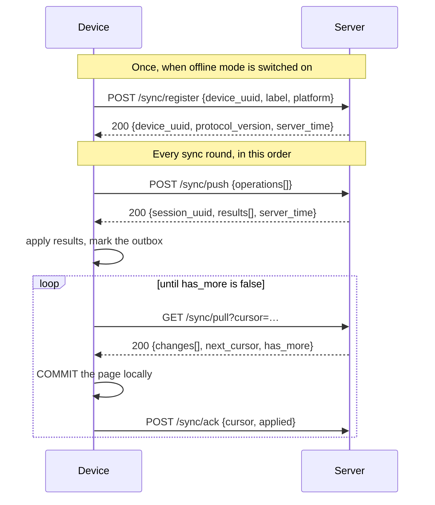

# Offline sync protocol

The wire contract between a device and the server. Written for whoever has to
implement a second client, debug a stuck device, or change the protocol without
breaking the ones already in the field.

**Protocol version:** 1 · **Base:** `/api/v1/sync` · **Auth:** Sanctum — the
session cookie for a browser on this origin, a bearer token for anything else ·
**Envelope:** the standard `ApiResponse` shape used by the rest of the API.

---

## 1. The shape of it



**Push before pull, always.** Local work goes up before server changes come
down, so a record the device created is on the server before anything can
arrive claiming to describe it.

---

## 2. Every request

| Header | Required | Notes |
|---|---|---|
| `Authorization: Bearer …` | for a non-browser client | Sanctum. The hospital comes from the authenticated user and **never from the payload**. |
| the session cookie | for a browser on this origin | Field Mode sends no token. `credentials: 'same-origin'` on every request; the API routes see the session because of `$middleware->statefulApi()`. |
| `X-XSRF-TOKEN: …` | for a browser, on every write | Read from the `XSRF-TOKEN` cookie **at request time**. Without it a stateful `POST` is `419`. |
| `X-Device-Id: <uuid>` | yes, except `register`, `status` and `reference` — **enforced** on `push`, `pull`, `ack`, `resolve` and `operations` (push and operations used to accept a missing header) | An unregistered id is `403`; a revoked one is `403 device_revoked`. |
| `Accept: application/json` | yes | |

**`401` and `419` mean the same thing to a device:** the session has ended. Both
put every operation back to `pending` and neither discards anything. Retrying
without a new session is pointless, so the client stops and asks the user to
sign in rather than draining its backoff against a server that will refuse
identically.

`protocol_version` may be sent in the body. A mismatch is `409 protocol_mismatch`
and the request does no work at all.

---

## 3. `POST /sync/register`

Turns a browser into a device the hospital can see and revoke.

```jsonc
{ "device_uuid": "…", "label": "Maternity desk laptop", "platform": "Chrome/macOS" }
```

`label` is what an administrator reads on a list of machines holding patient
data, so it is required and is meant to name a place, not a browser.

Re-registering the same `device_uuid` updates the row and keeps its original
`registered_at`. A **revoked** device is refused (`403`) — a blocked machine
cannot re-register itself out of trouble.

---

## 4. `GET /sync/status`

Cheap on purpose: the client calls it as a reachability probe every 15 seconds
while offline, so it must not do real work.

```jsonc
{
  "protocol_version": 1,
  "server_time": "2026-09-19T12:04:11+00:00",
  "hospital_id": 7,
  "device": { "device_uuid": "…", "label": "…", "last_sync_at": "…", "pull_cursor": "…", "revoked": false },
  "accepts": ["patients", "visits", "vitals", "nursing_notes", "med_administrations", "lab_items"],
  "current_revision": 1923,
  "open_conflicts": 0
}
```

`server_time` is how a device measures its own clock. `accepts` lets a client
find out what this server understands on connect, rather than one rejected
operation at a time.

---

## 5. `POST /sync/push`

```jsonc
{
  "protocol_version": 1,
  "operations": [
    {
      "operation_id": "01M2WE0Z9X55XVR8T34BW3AHRK",   // ULID, unique for ever
      "entity": "patients",
      "entity_uuid": "bf3f8264-…",                     // the record's own id
      "operation": "create",                           // create|update|delete|intent
      "payload": { "uuid": "bf3f8264-…", "first_name": "Amina", "last_name": "Nakato" },
      "base_version": null,                            // the version this edit was made against
      "base_fields": null,                             // what the device last had CONFIRMED
      "client_created_at": "2026-09-19T11:58:02+03:00"
    }
  ]
}
```

### Rules

- **`operation_id` is the idempotency key.** A ULID, minted once and never
  reused, not even on retry. It is what makes a replay safe.
- **`payload` is the whole record, not a diff.** A delta computed against a base
  the server has moved past is unapplicable hours later.
- **`base_fields` is the third side of a three-way merge** — the values the
  device last had *confirmed by the server* for the fields it is changing. With
  it, "did the server change this too?" is a fact. Without it the server must
  assume the worst, and every online edit blocks every offline one.
- **Batch cap: 200.** More is `422`, never silently truncated.
- The batch is ordered: send a parent before its children.

### Response

```jsonc
{
  "success": true, "code": "ok",
  "data": {
    "session_uuid": "…",
    "server_time": "…",
    "results": [ /* one per operation, in order */ ]
  }
}
```

| `status` | Meaning | What the client does |
|---|---|---|
| `accepted` | Applied now | Store `server_id`, `version`, `assigned`; mark synced |
| `already_processed` | Applied earlier; this was a replay | Identical handling. **This is the lost-response path.** |
| `conflict` | Somebody changed it first | Store the conflict; auto-merge where the strategy says; otherwise ask a person |
| `rejected` | Refused, with a reason | Keep the payload, show the reason, offer edit-and-retry |
| `failed` | The server could not finish | Back to pending with a backoff |

```jsonc
// accepted — note `assigned`, the values the device could not know
{ "operation_id": "01M2…", "status": "accepted", "server_id": 913, "version": 1,
  "assigned": { "patient_no": "PT-2026-000043K" } }

// rejected — per-field, so the device can put it beside the field
{ "operation_id": "01M2…", "status": "rejected", "reason_code": "validation_failed",
  "message": "This patient could not be saved as recorded.",
  "errors": { "last_name": ["The last name field is required."] } }

// conflict — field NAMES, never values
{ "operation_id": "01M2…", "status": "conflict",
  "conflict": { "strategy": "manual", "base_version": 1, "server_version": 2,
                "contested": ["dob"], "merged": [], "server_state": { "dob": "1991-05-05" } } }
```

### Reason codes

| Code | Meaning |
|---|---|
| `validation_failed` | The payload did not pass the same rules the online form uses |
| `forbidden` | The user's permissions no longer allow this |
| `not_found` | The record has gone |
| `parent_missing` | The visit or admission has not arrived yet — **an ordering problem; retry under the same `operation_id`** |
| `parent_closed` | The stay is discharged, or the lab order is closed; nothing more can be recorded on it |
| `already_reported` | A result is already recorded for this test. Correcting one is done where both values can be seen |
| `append_only` | This record cannot be changed, only superseded |
| `unknown_entity` | This server does not accept that entity |
| `unsupported_operation` | That verb is not valid for that entity |
| `refused` | A domain rule said no, with the rule's own words |
| `server_error` | Something broke; nothing was applied. **Retry under the same `operation_id`** |
| `abandoned` | The server stopped mid-operation (set by the 15-minute sweep); nothing was applied. Retry under the same id |
| `in_flight` | Another attempt at this operation is still running. Retry later |
| `missing_operation_id` | No id, so no way to make a retry safe |
| `unknown_operation` | The id belongs to another hospital. Never retry; mint a new id |

**Which answers are final.** `server_error`, `abandoned` and `parent_missing`
mean nothing was applied and the cause can go away on its own: a retry of the
**same** `operation_id` runs the work again (`OperationLedger::RETRYABLE`). Two
retries arriving together are settled by an atomic claim — exactly one runs,
the other gets `in_flight`. Every other answer is about the data (accepted,
conflict, a validation or permission refusal) and a replay returns it verbatim.
Before 2026-09-26 every stored answer was final, so one transient 500 poisoned
an operation id for ever.

---

## 6. `GET /sync/pull?cursor=…`

```jsonc
{
  "changes": [
    { "entity": "patients", "revision": 1841,
      "record": { "uuid": "…", "server_id": 913, "version": 2, "first_name": "Amina",
                  "deleted_at": null } }
  ],
  "next_cursor": "eyJpdiI6…",
  "has_more": true,
  "current_revision": 1923
}
```

### Rules

- **Ordered by revision**, a per-hospital monotonic counter. Not by timestamp:
  timestamps collide at second resolution, and rows written in one transaction
  can straddle a reader's cursor so a change is skipped and never re-sent.
- **Streams are interleaved**, not concatenated. Patients and visits come back
  in one revision-ordered sequence, so a cursor advanced past a full page of
  patients cannot skip the visits written in the same window.
- **The cursor is encrypted and bound to (hospital, device).** One that this
  server did not issue reads as "start from the beginning" rather than being
  explained — a forged cursor is a claim to data, and telling it what it got
  wrong would help it guess better.
- **`deleted_at` is a tombstone.** A deleted record is *sent*, not omitted;
  omitting it leaves the device holding it for ever.
- **Page size 200**, `has_more` until drained.

### The client's obligation

```
download page → COMMIT it locally → then advance the cursor
```

Never the other order. A crash between advancing and saving loses the whole
page permanently, because the server will not send it again.

---

## 7. `POST /sync/ack`

```jsonc
{ "cursor": "eyJpdiI6…", "applied": 200 }
```

Records where the device *says* it got to, for the administrator's view and so
a wiped device can be told where it was. **The device's own copy is authority**
for what it asks for next; a server that decided the cursor could skip a page
the device failed to commit.

---

## 7a. `POST /sync/resolve`

A conflict settled on the device. "Keep mine" needs nothing here — its new
operation closes the conflict when the server accepts it (resolution
`kept_mine`). "Keep the server's" sends no operation, so the device says so:

```json
{ "operation_id": "01M2…", "resolution": "kept_server" }   // or kept_mine | cancelled
```

Returns `{ "closed": 1 }`. A device can close only its own conflicts;
`GET /sync/status` counts only this device's open ones when `X-Device-Id` is sent.

---

## 8. `GET /sync/reference?since=…`

Catalogues the device reads and never edits: wards, beds, services, lab tests,
medication names. Scoped by permission — a nurse gets no formulary.

**Nothing here carries a balance.** A stock quantity changes by the minute, and
a device showing a stale one would be telling a pharmacist something untrue.

---

## 9. Entities

| Entity | Verbs | Conflict strategy | Notes |
|---|---|---|---|
| `patients` | create · update · delete | Three-way field merge; `dob`, `sex`, `blood_type`, `allergies`, `chronic_conditions` are never auto-merged | `patient_no` is server-allocated and returned in `assigned` |
| `vitals` | create | none — append-only | Needs `admission_uuid`. `VitalRound` is an **inpatient** record |
| `nursing_notes` | create | none — append-only | Needs `admission_uuid` |
| `med_administrations` | create | none — append-only | Needs `admission_uuid`. `status` is one of `given`, `withheld`, `refused` (`MedicationAdminStatus`, validated with the web form's own rule) — anything else is `rejected: validation_failed` |
| `visits` | update | Three-way field merge, but **every field is never-auto-merged** | The clinical narrative only — `complaints`, `diagnosis`, `doctor_remarks`. Anything else in the payload is dropped, not refused. A visit is never **created** from a device (`visit_no` is server-allocated and opening one bills a consultation), and one past the `ongoing` stage is `parent_closed`. The narrative is pulled only to an actor with `visits.diagnose` |
| `lab_items` | update | **Manual, always.** No merge under any circumstances | The strictest entity here. A stale device overwriting a result is a patient-safety event, so a mismatched `base_version` is refused and raised. A result that already exists is refused even when versions agree. Never created from a device |

An `update` on an append-only entity is `rejected: append_only`, not
`forbidden` — the record is immutable for everyone, and answering "forbidden"
would send somebody looking for an access right that would not help.

---

## 10. Extending it

**Adding an entity.** Write an `EntityHandler`, register it in
`SyncEngine::handlerFor()`, add the store to `resources/js/offline/db.js` in a
**new** Dexie version, and add it to `PullService::streams()` if devices should
receive it. Old clients skip entities they do not know, so a server deploy does
not break them.

**Changing the wire format.** Bump `SyncController::PROTOCOL_VERSION` and
`SYNC_PROTOCOL_VERSION` in `db.js`. Mismatched devices get `409` and a message
telling the user to reload; their unsent work is untouched.

**What you must not do:**

- Do not reuse an `operation_id`. Ever.
- Do not make the client compute a balance, a sequence number or a total.
- Do not send a diff instead of a whole payload.
- Do not let sync write rows directly. Everything goes through the domain
  Service that owns the rule, or every invariant those Services hold is bypassed
  for offline users only.
